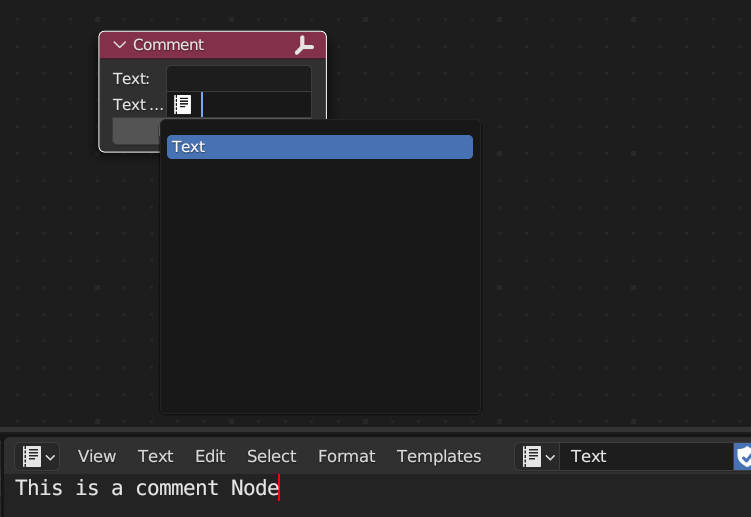

# Comment Node

This script was modified from: https://github.com/ly29/GenericNote/blob/master/generic_note.py

Since it only supports blender 2.7, I modified it to support blender 3.x.
___

## How To Use

1. Installing scripts via add-on

2. In the shader editor, select the comments node via the add menu

3. There are three ways to add text

    - Type in Text Field

    

    -  Text From Text Editor
    

    -  Text From Clipboard

## Related links

- [GenericNote](https://github.com/ly29/GenericNote)